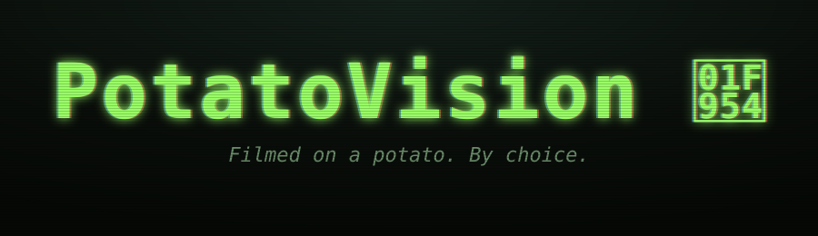

# PotatoVision 🥔📷



> Filmed on a potato. By choice.

<p align="center">
  
</p>

A tiny, dependency-free web app that turns your webcam feed into the worst
possible video on demand. Drag the **Potato Level** slider from 0 to 100 and
watch your beautiful HD self disintegrate into pixelated, color-quantized,
chromatically-bleeding, scanlined, sickly-green found-footage glory.

Bonus: **🥔 Emoji Mode** renders the feed as a live grid of potato emojis.

## Run it

It's a static page. Two options:

```bash
# Option A — open the file directly
open index.html        # macOS
xdg-open index.html    # Linux

# Option B — serve it (recommended; some browsers prefer http for getUserMedia)
python3 -m http.server 8000
# then visit http://localhost:8000
```

Click **Start camera**, accept the permission prompt, and start ruining your
own face.

## Features

- **Single slider** drives a multi-stage degradation pipeline:
  - resolution drop (down to 28×21 pixels)
  - per-channel color quantization (8 → 1 bits)
  - chromatic ghosting / RGB ghost
  - CRT scanlines
  - radial vignette
  - sickly-green color cast at maximum potato
  - frame stutter — at high levels, frames spontaneously hold to fake bandwidth starvation
- **Presets** — *Pristine*, *Zoom 2020*, *Skype 2008*, *Found Footage*, *Actual Potato*
- **📸 Snap** — downloads the current frame as a `potatovision-<timestamp>.png`,
  re-encoded through a punishing JPEG pass, with a red `● REC` and a date stamp
  for that early-2000s camcorder vibe
- **🥔 Emoji Mode** — replaces the canvas with a live, animated 🥔/🍟/🟧/🟫/⬛ grid

## Use it as your Zoom camera

PotatoVision is a web page, so it can't pretend to be a system webcam by
itself — Zoom, Meet, and Teams pick from OS-level camera devices. The
shortest path to "my video call now looks like a potato" is **[OBS
Studio](https://obsproject.com)**, which is free and exists on macOS,
Windows, and Linux:

1. Run PotatoVision locally: `python3 -m http.server 8000`.
2. In OBS, add a **Browser Source** pointing at `http://localhost:8000`
   (1280×720 is a good size). Click **Start camera** inside the source's
   interaction window once, so the page has camera permission.
3. Drag the **Potato Level** slider to taste. The OBS preview updates live.
4. Click **Start Virtual Camera** in OBS.
5. In Zoom (or Meet, Teams, Discord, etc.), pick **OBS Virtual Camera** as
   your camera.

PotatoVision and OBS both stay fully local — the page renders in your
browser and OBS reads that canvas off your machine to expose a virtual
camera device. Once you select **OBS Virtual Camera** inside Zoom/Meet/
Teams, though, the conferencing app transmits that video to the call like
any other webcam feed. The "no frames leave your machine" promise covers
PotatoVision itself, not whatever app you point at the virtual camera.

## Privacy

No frames leave your machine. There is no backend. Closing the tab pauses the
camera. So does switching to another tab — and `tests.html` asserts this.
The code is plain JS in `potatovision.js` — read it.

## Browser support

- ✅ Chromium / Chrome / Edge
- ✅ Firefox
- ⚠️ Safari — `getUserMedia` requires HTTPS or `localhost`
- ❌ IE — sorry, the potato is too modern

## Tests

There's no test runner — open `tests.html` in a browser the same way you run
the app. It imports `potatovision.js` against stub DOM elements and runs ~60
assertions covering the per-stage effect math, the `index.html` DOM contract,
the snapshot path, and the camera-paused-when-tab-hidden privacy promise.
Pass/fail counts at the top.

## Files

```
potatovision/
├── index.html               # markup
├── styles.css               # retro-CRT theme
├── potatovision.js          # all runtime logic
├── tests.html               # in-browser assertion harness
├── title.svg                # README banner
├── preview-skype-2008.svg   # README preview frame
├── CLAUDE.md                # contributor / agent guide
└── README.md
```

No build step, no `package.json`, no framework. Just the web platform.

## License

MIT
